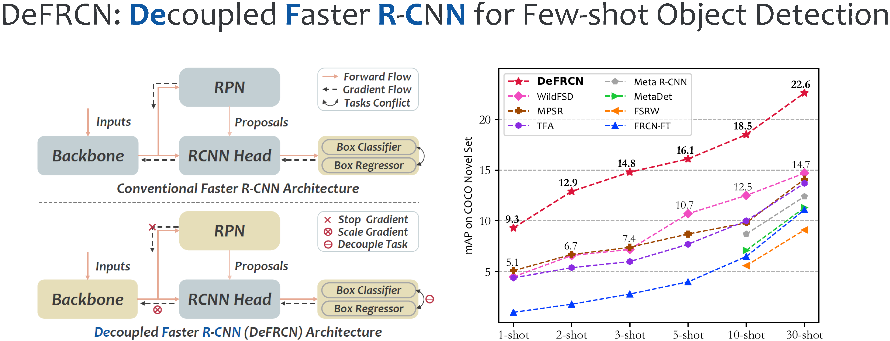

<div align="center"></div>

## Introduction

This repo contains the official PyTorch implementation of Background Discriminative Knowledge Minimizing Regulator for Few-Shot Object Detection.

## Quick Start

**1. Check Requirements**
* Linux with Python >= 3.6
* [PyTorch](https://pytorch.org/get-started/locally/) >= 1.6 & [torchvision](https://github.com/pytorch/vision/) that matches the PyTorch version.
* CUDA 10.1, 10.2
* GCC >= 4.9

**2. Build BDKMR**
* Clone Code
  ```angular2html
  git clone https://github.com/ZYN-1101/BDKMR.git
  cd BDKMR
  ```
* Create a virtual environment (optional)
  ```angular2html
  virtualenv bdkmr
  cd /path/to/venv/bdkmr
  source ./bin/activate
  ```
* Install PyTorch 1.6.0 with CUDA 10.1 
  ```shell
  pip3 install torch==1.6.0+cu101 torchvision==0.7.0+cu101 -f https://download.pytorch.org/whl/torch_stable.html
  ```
* Install Detectron2
  ```angular2html
  python3 -m pip install detectron2==0.3 -f https://dl.fbaipublicfiles.com/detectron2/wheels/cu101/torch1.6/index.html
  ```
  - If you use other version of PyTorch/CUDA, check the latest version of Detectron2 in this page: [Detectron2](https://github.com/facebookresearch/detectron2/releases). 
  - Sorry for that I don’t have enough time to test on more versions, if you run into problems with other versions, please let me know.
* Install other requirements. 
  ```angular2html
  python3 -m pip install -r requirements.txt
  ```

**3. Prepare Data and Weights**
* Data Preparation
  - We evaluate our models on two datasets for both FSOD and G-FSOD settings:

    | Dataset | Size | GoogleDrive | BaiduYun | Note |
    |:---:|:---:|:---:|:---:|:---:|
    |VOC2007| 0.8G |[download](https://drive.google.com/file/d/1BcuJ9j9Mtymp56qGSOfYxlXN4uEVyxFm/view?usp=sharing)|[download](https://pan.baidu.com/s/1kjAmHY5JKDoG0L65T3dK9g)| - |
    |VOC2012| 3.5G |[download](https://drive.google.com/file/d/1NjztPltqm-Z-pG94a6PiPVP4BgD8Sz1H/view?usp=sharing)|[download](https://pan.baidu.com/s/1DUJT85AG_fqP9NRPhnwU2Q)| - |
    |vocsplit| <1M |[download](https://drive.google.com/file/d/1BpDDqJ0p-fQAFN_pthn2gqiK5nWGJ-1a/view?usp=sharing)|[download](https://pan.baidu.com/s/1518_egXZoJNhqH4KRDQvfw)| refer from [TFA](https://github.com/ucbdrive/few-shot-object-detection#models) |
    |COCO| ~19G | - | - | download from [offical](https://cocodataset.org/#download)|
    |cocosplit| 174M |[download](https://drive.google.com/file/d/1T_cYLxNqYlbnFNJt8IVvT7ZkWb5c0esj/view?usp=sharing)|[download](https://pan.baidu.com/s/1NELvshrbkpRS8BiuBIr5gA)| refer from [TFA](https://github.com/ucbdrive/few-shot-object-detection#models) |
  - Unzip the downloaded data-source to `datasets` and put it into your project directory:
    ```angular2html
      ...
      datasets
        | -- coco (trainval2014/*.jpg, val2014/*.jpg, annotations/*.json)
        | -- cocosplit
        | -- VOC2007
        | -- VOC2012
        | -- vocsplit
      bdkmr
      tools
      ...
    ```
* Weights Preparation
  - We use the imagenet pretrain weights to initialize our model. Download the same models from here: [GoogleDrive](https://drive.google.com/file/d/1rsE20_fSkYeIhFaNU04rBfEDkMENLibj/view?usp=sharing) [BaiduYun](https://pan.baidu.com/s/1IfxFq15LVUI3iIMGFT8slw)
  - Download the base model of COCO dataset from here: [GoogleDrive](https://drive.google.com/file/d/157zskHhdgOQDcTtZB7hfzA4_glQjIcDU/view?usp=sharing)

**4. Training and Evaluation**

For ease re-producing, we integrate the whole pipeline of few-shot object detection into one script `run_*.sh`.
* To reproduce the results on COCO
  ```angular2html
  bash run_coco.sh
  ```

## Acknowledgement
This repo is developed based on [DeFRCN](https://github.com/er-muyue/DeFRCN) and [Detectron2](https://github.com/facebookresearch/detectron2). Please check them for more details and features.

```
